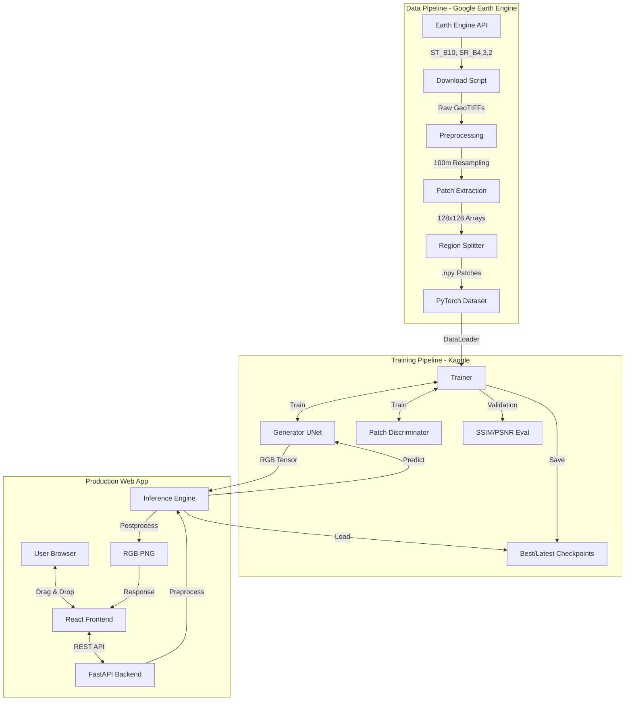
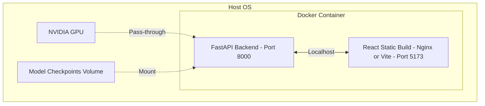

# InfraNova AI — System Architecture

This document explains the overarching system architecture of InfraNova AI, detailing how the machine learning, data, and web components interact.

## 1. High-Level System Architecture

InfraNova AI operates through three distinct architectural phases: **Data Acquisition**, **Model Training**, and **Web Inference**.

## 2. Core Components

### 2.1 The Data Architecture
**Responsibility**: Acquiring, standardizing, and feeding Landsat 9 satellite data into the model.

- **Inputs**: Google Earth Engine API boundaries, bounding boxes.
- **Outputs**: Paired `tir_100m.npy` (128×128, single-channel) and `rgb_100m.npy` (128×128, 3-channel) patches.
- **Dependencies**: `earthengine-api`, `rasterio`, `numpy`, `cv2`.
- **Key Modules**: 
  - `scripts/download/download_landsat9.py` (GEE integration)
  - `scripts/preprocessing/process_landsat_patches.py` (Patch extraction)
  - `src/datasets/landsat9_dataset.py` (PyTorch Dataset integration)

### 2.2 The ML Architecture (Pix2Pix GAN)
**Responsibility**: Learning the mapping from thermal heatmaps to visible-light RGB.

- **Inputs**: 128×128 TIR tensors in `[-1, 1]`.
- **Outputs**: 128×128 RGB tensors in `[-1, 1]`.
- **Dependencies**: `torch`, `torchvision` (for Perceptual Loss).
- **Key Modules**:
  - `src/models/pix2pix/pix2pix.py` (Wrapper for G and D)
  - `src/models/pix2pix/generator_dynamic.py` (Dynamic U-Net Generator)
  - `src/models/pix2pix/discriminator.py` (PatchGAN Discriminator)

### 2.3 The Training Architecture
**Responsibility**: Coordinating the adversarial training loop, managing learning rates, and tracking metrics.

- **Inputs**: PyTorch DataLoaders, configuration YAML.
- **Outputs**: `.pth` checkpoint files, CSV logs, visualizations.
- **Dependencies**: `torch.amp` (Mixed Precision), `torch.nn.DataParallel`.
- **Key Modules**:
  - `src/training/train_landsat.py` (Entry point, dataset setup)
  - `src/training/trainer.py` (Main training loop, validation, metric tracking)
  - `src/training/losses.py` (L1, GAN, Perceptual, SSIM, Chroma)

### 2.4 The Web Inference Architecture
**Responsibility**: Exposing the trained model to users via a modern, interactive web interface.

- **Inputs**: User-uploaded images (`.tif`, `.png`, `.jpg`).
- **Outputs**: Colorized RGB images, thermal preview images.
- **Dependencies**: `FastAPI`, `React`, `Vite`, `PIL`, `numpy`.
- **Key Modules**:
  - `api/main.py` (FastAPI router)
  - `demo/inference.py` (Web-optimized inference engine)
  - `web/src/App.jsx` (React UI)

## 3. Deployment Architecture

The system is designed for containerized deployment, though the current Docker configuration is stale (references an old Streamlit app). 

When updated, the architecture should be:

*Note: The current React+FastAPI stack is run natively on the host during development via `npm run dev` and `uvicorn api.main:app`.*
